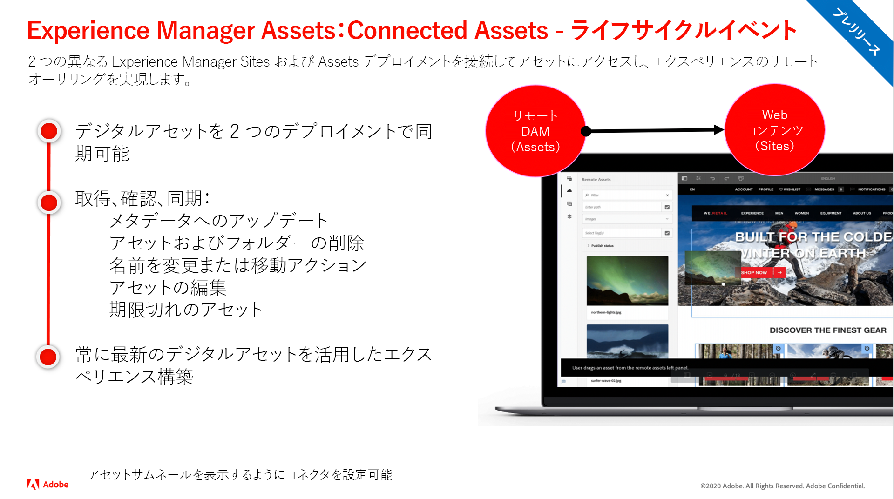

# Adobe Experience Manager as a Cloud Serviceリリースのアップデート

Adobe Experience Manager as a Cloud Serviceの最新機能の概要を簡単に説明します。 これらは、AEM製品チームが最新リリースの概要を共有する、約 10 分間の短いビデオです。

## 最新の更新

<table style="max-width: 50%;">
<tr>
  <td>
    
    

      <a href="./2022/2022-3-0.md">
        <strong>リリース | 2022.3.0</strong>
         
      </a>
        <em>リリース日： 2022 年 3 月 31 日 </em>
    

    

      <a href="https://experienceleague.adobe.com/docs/experience-manager-cloud-service/content/release-notes/release-notes/release-notes-current.html">リリースノート</a>
    

  </td>
</tr>  
</table>

## 過去の更新

<table style="max-width: 50%;">
<tr>
  <td>
    
    

      <a href="./2022/2022-1-0.md">
        <strong>リリース | 2022.1.0</strong>
         
      </a>
        <em>リリース日： 2022 年 2 月 4 日 </em>
    

    

      <a href="https://experienceleague.adobe.com/docs/experience-manager-cloud-service/content/release-notes/release-notes/2022/release-notes-2022-1-0.html">リリースノート</a>
    

  </td>
  <td>
    
    

    <a href="./2021/2021-11-0.md">
        <strong>リリース | 2021.11.0</strong>
         
      </a>
    <em>リリース日： 2021 年 12 月 16 日</em>
    

    

      <a href="https://experienceleague.adobe.com/docs/experience-manager-cloud-service/content/release-notes/release-notes/2021/release-notes-2021-11-0.html">リリースノート</a>
    

  </td>
</tr>
</table>
