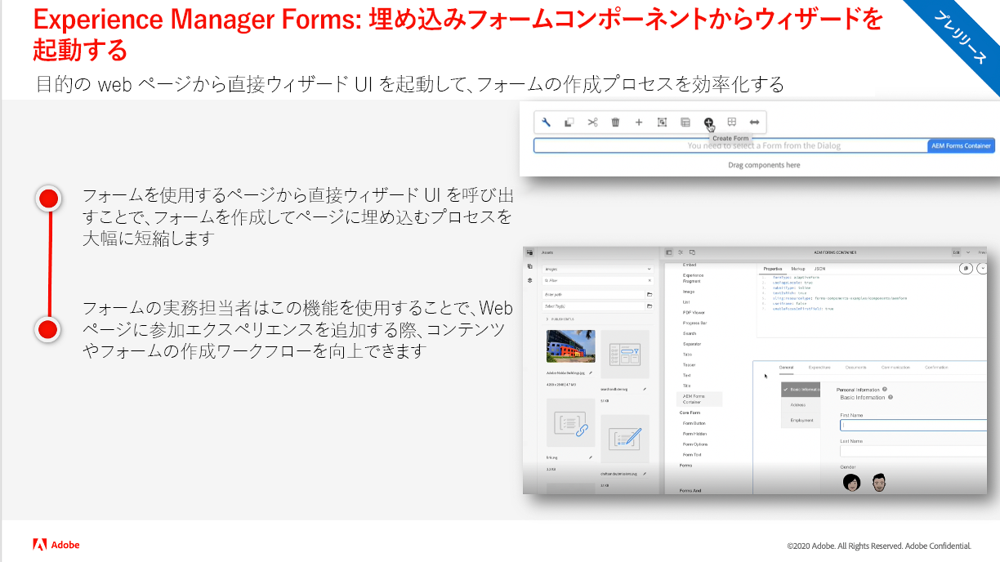

# Adobe Experience Manager as a Cloud Service リリースアップデート

Adobe Experience Manager as a Cloud Service の最新機能の概要を説明します。AEM 製品チームが最新リリースの概要を説明する、約 10 分間の短いビデオです。

## 最新のアップデート

<!---

<table style="max-width: 50%;">
  <tr>
    <td>
      
      

        <a href="./2023/2023-1-0.md">
          <strong>Release | 2023.1.0</strong>
           
        </a>
          <em>Release date  Feb 2023 </em>
      

      

        <a href="https://experienceleague.adobe.com/docs/experience-manager-cloud-service/content/release-notes/release-notes/release-notes-current.html">Release notes</a>
      

    </td>
  </tr>  
</table> 

## Past Updates

<table style="max-width: 50%;">
  <tr>
    <td>
      
      

        <a href="./2022/2022-10-0.md">
          <strong>Release | 2022.10.0</strong>
           
        </a>
          <em>Release date  Oct 13, 2022 </em>
      

      

        <a href="https://experienceleague.adobe.com/docs/experience-manager-cloud-service/content/release-notes/release-notes/release-notes-current.html">Release notes</a>
      

    </td>  
    <td>
      
      

        <a href="./2022/2022-8-0.md">
          <strong>Release | 2022.8.0</strong>
           
        </a>
          <em>Release date  Sept 1, 2022 </em>
      

      

        <a href="https://experienceleague.adobe.com/docs/experience-manager-cloud-service/content/release-notes/release-notes/release-notes-current.html">Release notes</a>
      

    </td>
    <td>
      
      

        <a href="./2022/2022-7-0.md">
          <strong>Release | 2022.7.0</strong>
           
        </a>
          <em>Release date  Aug 8, 2022 </em>
      

      

        <a href="https://experienceleague.adobe.com/docs/experience-manager-cloud-service/content/release-notes/release-notes/release-notes-current.html">Release notes</a>
      

    </td>
  </tr>
  <tr> 
    <td>
      
      

        <a href="./2022/2022-6-0.md">
          <strong>Release | 2022.6.0</strong>
           
        </a>
          <em>Release date  June 30, 2022 </em>
      

      

        <a href="https://experienceleague.adobe.com/docs/experience-manager-cloud-service/content/release-notes/release-notes/release-notes-current.html">Release notes</a>
      

    </td>
    <td>
      
      

        <a href="./2022/2022-5-0.md">
          <strong>Release | 2022.5.0</strong>
           
        </a>
          <em>Release date  June 9, 2022 </em>
      

      

        <a href="https://experienceleague.adobe.com/docs/experience-manager-cloud-service/content/release-notes/release-notes/release-notes-current.html">Release notes</a>
      

    </td>
    <td>
      
      

        <a href="./2022/2022-4-0.md">
          <strong>Release | 2022.4.0</strong>
           
        </a>
          <em>Released  May 5, 2022 </em>
      

      

        <a href="https://experienceleague.adobe.com/docs/experience-manager-cloud-service/content/release-notes/release-notes/release-notes-current.html">Release notes</a>
      

    </td>
  </tr>
  <tr> 
    <td>
      
      

        <a href="./2022/2022-3-0.md">
          <strong>Release | 2022.3.0</strong>
           
        </a>
          <em>Released  March 31, 2022 </em>
      

      

        <a href="https://experienceleague.adobe.com/docs/experience-manager-cloud-service/content/release-notes/release-notes/release-notes-current.html">Release notes</a>
      

    </td>
    <td>
      
      

        <a href="./2022/2022-1-0.md">
          <strong>Release | 2022.1.0</strong>
           
        </a>
          <em>Released  February 3, 2022 </em>
      

      

        <a href="https://experienceleague.adobe.com/docs/experience-manager-cloud-service/content/release-notes/release-notes/2022/release-notes-2022-1-0.html">Release notes</a>
      

    </td>
    <td>
      
      

      <a href="./2021/2021-11-0.md">
          <strong>Release | 2021.11.0</strong>
           
        </a>
      <em>Released  December 16, 2021</em>
      

      

        <a href="https://experienceleague.adobe.com/docs/experience-manager-cloud-service/content/release-notes/release-notes/2021/release-notes-2021-11-0.html">Release notes</a>
      

    </td>
  </tr>
</table>

--->

<table style="max-width: 50%;">
  <tr>
    <td>
      
      

        <a href="./2022/2022-10-0.md">
 <strong>リリース | 2022.10.0</strong>
         
        </a>
        <em>リリース日： 2022年10月13日</em>
      

      

        <a href="https://experienceleague.adobe.com/docs/experience-manager-cloud-service/content/release-notes/release-notes/release-notes-current.html?lang=ja">リリースノート</a>
      

    </td>
  </tr>  
</table>

## 過去のアップデート

<table style="max-width: 50%;">
  <tr>
    <td>
      
      

        <a href="./2022/2022-8-0.md">
          <strong>リリース | 2022.8.0</strong>
           
       </a>
          <em>リリース日： 2022年9月1日（PT）</em>
      

      

        <a href="https://experienceleague.adobe.com/docs/experience-manager-cloud-service/content/release-notes/release-notes/release-notes-current.html?lang=ja">リリースノート</a>
      

    </td>
    <td>
      
      

        <a href="./2022/2022-7-0.md">
        <strong>リリース | 2022.7.0</strong>
         
      </a>
        <em>リリース日： 2022年8月8日（PT）</em>
      

      

        <a href="https://experienceleague.adobe.com/docs/experience-manager-cloud-service/content/release-notes/release-notes/release-notes-current.html?lang=ja">リリースノート</a>
      

    </td>
    <td>
      
      

        <a href="./2022/2022-6-0.md">
        <strong>リリース | 2022.6.0</strong>
         
      </a>
        <em>リリース日：2022年6月30日（PT）</em>
      

      

        <a href="https://experienceleague.adobe.com/docs/experience-manager-cloud-service/content/release-notes/release-notes/release-notes-current.html?lang=ja">リリースノート</a>
      

    </td>
  </tr>
  <tr>  
    <td>
      
      

        <a href="./2022/2022-5-0.md">
        <strong>リリース | 2022.5.0</strong>
         
      </a>
        <em>リリース日：2022年6月9日（PT）</em>
      

      

        <a href="https://experienceleague.adobe.com/docs/experience-manager-cloud-service/content/release-notes/release-notes/release-notes-current.html?lang=ja">リリースノート</a>
      

    </td>
    <td>
      
      

        <a href="./2022/2022-4-0.md">
        <strong>リリース | 2022.4.0</strong>
         
      </a>
        <em>リリース日：2022年5月5日（PT）</em>
      

      

        <a href="https://experienceleague.adobe.com/docs/experience-manager-cloud-service/content/release-notes/release-notes/release-notes-current.html?lang=ja">リリースノート</a>
      

    </td>
    <td>
      
      

        <a href="./2022/2022-3-0.md">
          <strong>リリース | 2022.3.0</strong>
         
      </a>
        <em>リリース日：2022年3月31日（PT）</em>
      

      

        <a href="https://experienceleague.adobe.com/docs/experience-manager-cloud-service/content/release-notes/release-notes/release-notes-current.html?lang=ja">リリースノート</a>
      

    </td>
  </tr>
  <tr>     
    <td>
      
      

        <a href="./2022/2022-1-0.md">
          <strong>リリース | 2022.1.0</strong>
         
      </a>
        <em>リリース日：2022年2月3日（PT）</em>
      

      

        <a href="https://experienceleague.adobe.com/docs/experience-manager-cloud-service/content/release-notes/release-notes/2022/release-notes-2022-1-0.html?lang=ja">リリースノート</a>
      

    </td>
    <td>
      
      

      <a href="./2021/2021-11-0.md">
          <strong>リリース | 2021.11.0</strong>
         
      </a>
    <em>リリース日：2021年12月16日（PT）</em>
      

      

        <a href="https://experienceleague.adobe.com/docs/experience-manager-cloud-service/content/release-notes/release-notes/2021/release-notes-2021-11-0.html?lang=ja">リリースノート</a>
      

    </td>
  </tr>
</table>
